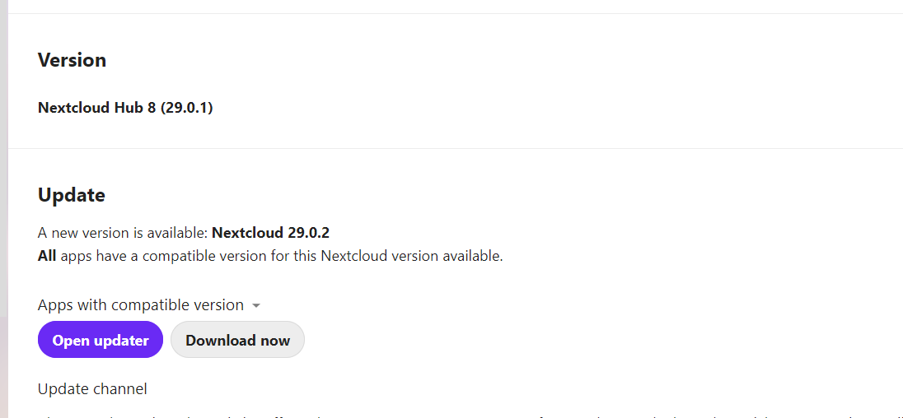

# Mydeskweb project
## Requirements
### Framework
1. docker version 26.1.4
2. docker compose v2.27.1

### Images
- nextcloud:latest   currently: 29.0.1
- mariadb:10.6
- redis:latest


### Docker containers required

# Update nextcloud
## Update manually
Update nextcloud happen time to time, the server shows in [https://mydeskweb.com/settings/admin/overview](administration/overview), there is a new version available as this 

As you can see in the image current version is 29.0.1 and a new update is available to version 29.0.2. to install the update do the following

### download the image the new image
update the nextcloud image
[nextCloudImage](/home/ubuntu/nextcloud/nextCloudImage/Dockerfile) and update the new version or leave as latest (see git history) as 
FROM nextcloud:latest
or  
FROM nextcloud:29.0.2

where 29.0.2 is the new version to install
execute the following commands manually 

```bash
cd ~/nextcloud/mywebdesk
docker-compose --env-file mydeskweb.com.env stop   # stop the container
docker-compose --env-file mydeskweb.com.env build  # rebuild the image to force download the desired varsion
docker-compose --env-file mydeskweb.com.env up -d  # start the container
```
look at the logs and view the website to make sure the update is complete and it shows the new version, sometimes an error happen and the website is not shown properly, as the problem shows you have to execute some of the following commands as the problem is.


### commands to fix errors
```bash
# 
# force the upgrade
docker exec -u www-data mydeskweb.com php occ maintenance:mode --off
docker exec -u www-data mydeskweb.com php occ upgrade

# fix missing indexes
docker exec -u www-data mydeskweb.com php occ db:add-missing-indices

# shut off maintenance mode and allow to update
docker exec -u www-data mydeskweb.com php occ maintenance:mode --off
```

Actually I cant write an automation process to update but look at the git history 
```text
2676986 (HEAD -> main) update to version 29.0.1
890e660 update to version 28.0.6
9f9c20a update to version 27.1.10
5c50516 update to version 25.0.13
36c828b update to version 25.0.13
98e5013 update to version 24.0.12
6520788 upgrade to version 23.0.12
d523a90 update to version 22.0.0.11
```